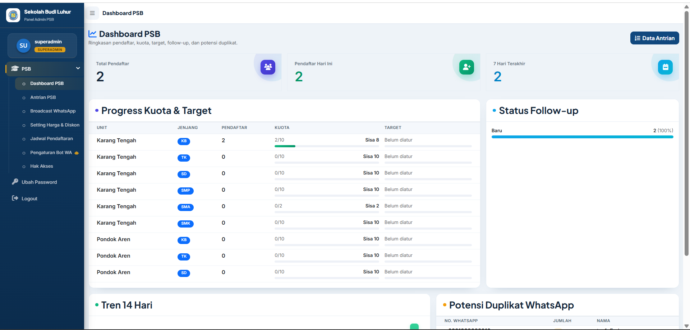

# 🎓 PSB Online & Real-Time Queue System

Aplikasi Penerimaan Siswa Baru (PSB) berbasis web yang mendukung proses pendaftaran online serta sistem perebutan nomor antrian pendaftaran secara real-time dengan pembatasan kuota.

## 📌 Tentang Project

Project ini dibuat untuk mempermudah proses penerimaan siswa baru mulai dari pendaftaran, pengelolaan data calon siswa, hingga pengambilan nomor antrian secara online tanpa harus datang ke sekolah.

Sistem dirancang agar banyak pengguna dapat mengakses halaman antrian secara bersamaan, namun setiap nomor antrian hanya dapat diambil satu kali.

## 👨‍💻 Role

Full Stack Developer

## 🛠️ Tanggung Jawab

- Analisis kebutuhan sistem
- Merancang database MySQL
- Mengembangkan backend menggunakan CodeIgniter 4
- Mengembangkan frontend menggunakan Bootstrap dan JavaScript
- Membuat sistem perebutan nomor antrian secara real-time
- Membuat dashboard monitoring pendaftaran
- Deployment dan maintenance aplikasi

## ✨ Fitur

### Untuk Calon Siswa
- Pendaftaran online
- Pengisian biodata
- Upload dokumen
- Pengambilan nomor antrian pendaftaran
- Informasi status pendaftaran

### Untuk Admin
- Dashboard monitoring
- Manajemen data pendaftar
- Manajemen nomor antrian
- Validasi data pendaftar
- Export data ke Excel
- Laporan pendaftaran

## 🚀 Fitur Unggulan

- Real-Time Queue System
- Pembatasan kuota nomor antrian
- Validasi nomor antrian agar tidak terduplikasi
- Monitoring antrian secara langsung
- Responsive Design

## 🗄️ Database

- admin
- calon_siswa
- pendaftaran
- antrian
- gelombang
- setting

## 🏗️ Tech Stack

- PHP
- CodeIgniter 4
- MySQL
- Bootstrap
- JavaScript
- AJAX
- jQuery
- DataTables

## 📷 Screenshot

### Dashboard

### Form Pendaftaran

### Nomor Antrian

### Monitoring Pendaftaran

## 📚 Yang Saya Pelajari

- Full Stack Web Development
- Database Design
- Real-Time Data Processing
- Transaction Management
- Problem Solving pada sistem multi-user
- Deployment dan Maintenance Web Application

---

⚠️ Repository ini merupakan portfolio project. Source code lengkap dan data produksi tidak dipublikasikan untuk menjaga kerahasiaan institusi.
